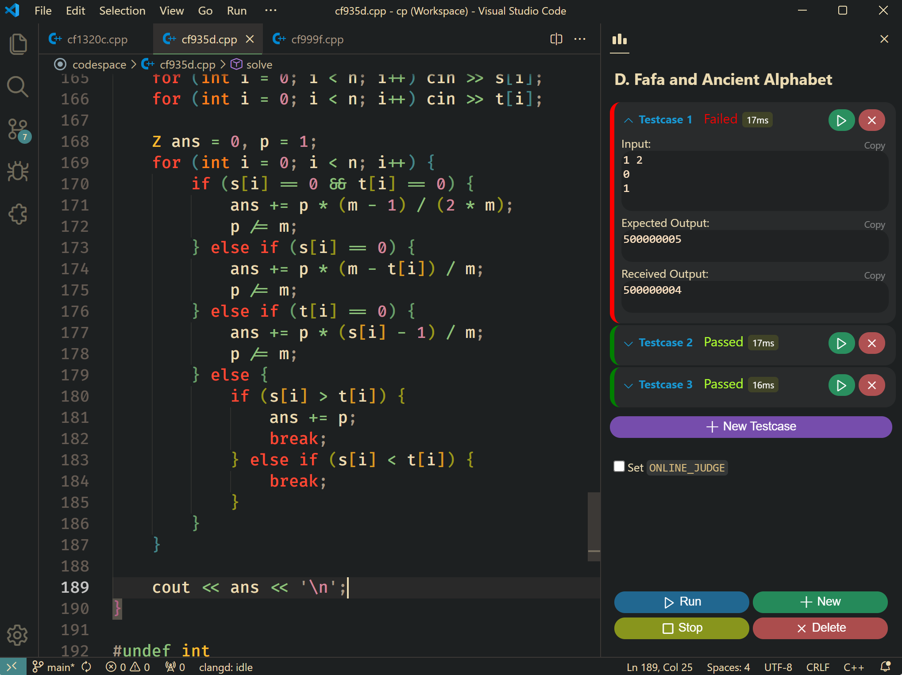

# neocph

> neocph is a simpler, faster, and better looking version of cph.

Quickly compile, run and judge competitive programming problems in VS Code.
Automatically download testcases , or write & test your own problems.

neocph supports a large number of popular platforms like Codeforces, Codechef,
TopCoder etc. with the help of competitive companion browser extension

## Quick start

1. Open any folder and create a problem file.
1. [Optional] Install
   [Competitive Companion](https://github.com/jmerle/competitive-companion#readme)
   in your browser to parse the testcases.
1. Press <kbd>Ctrl</kbd>+<kbd>R</kbd> to run your code.

## Features

-   Automatic compilation with display for compilation errors.
-   Intelligent judge with support for signals, timeouts and runtime errors.
-   Works with Competitive Companion.
-   Works locally for your own problems.
-   Support for several languages.

## Supported Languages

-   C++
-   C
-   C# Script
-   Rust
-   Go
-   Haskell
-   Python
-   Ruby
-   Java
-   JavaScript (Node.js)

## Contributing

You can contribute to this extension in many ways:

-   File bug reports by creating issues.
-   Develop this extension further - see [developer guide](docs/dev-guide.md).
-   Spreading the word about this extension.

**Before creating a Pull Request, please create an issue to discuss the
approach. It makes reviewing and accepting the PR much easier.**

## Original License

Copyright (C) 2023 Divyanshu Agrawal

This program is free software: you can redistribute it and/or modify it under
the terms of the GNU General Public License as published by the Free Software
Foundation, either version 3 of the License, or (at your option) any later
version.

This program is distributed in the hope that it will be useful, but WITHOUT ANY
WARRANTY; without even the implied warranty of MERCHANTABILITY or FITNESS FOR A
PARTICULAR PURPOSE. See the GNU General Public License for more details.

You should have received a copy of the GNU General Public License along with
this program. If not, see https://www.gnu.org/licenses/.
